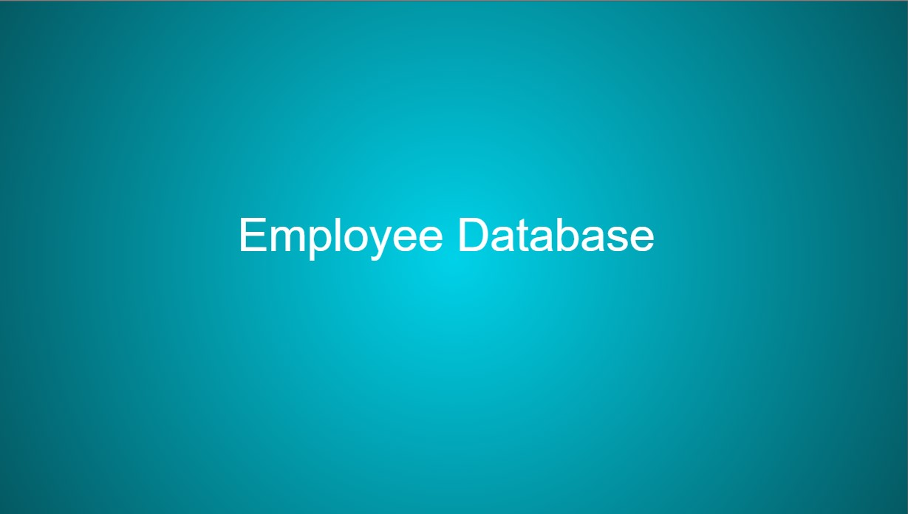

<div align="center">

# Employee Database

</div>


<div align="center">

[](https://opensource.org/licenses/MIT) 

</div>


### Motivation

The idea was to further my knowledge with asyncronous code whilst also creating an intuitive employee registry that is updateable.

### Problem

Combining employee information in a easy to understand format whilst also providing the ability to update the registry if need be.

## Requirements

This application a command line with node.js and applicable dependancies.

## Further Developments

### Further Changes

- Update the 'update employee' to be more accurate when selecting to update management roles.

## Table of Contents

* [Installation](#installation)
* [Credits](#credits)
* [Questions](#questions)

## Installation

Copy the URL for this repo, then from the command line

```
git clone {url}
```

Required Dependancies; node.js (version v16.14.2 <), Inquirer (^8.2.4), mysql (^2.3.3), dotenv (^16.0.0), express (^4.18.1) console.table (^0.10.0). 
These can be installed once the application is downloaded.
Run;

```
npm init -y
npm i (installs dependancies)
```

To run the application, use;

```
npm start
```

## How to Use

This video will run through how to use the application from the command line.

[](https://youtu.be/JJv_0FzKfFQ)

## Credits

[Origin 42](hyperlink): Dave Plummer

## Questions

Direct any questions too;

- [origin-42](https://github.com/origin-42)
- d.plummer89@hotmail.com

